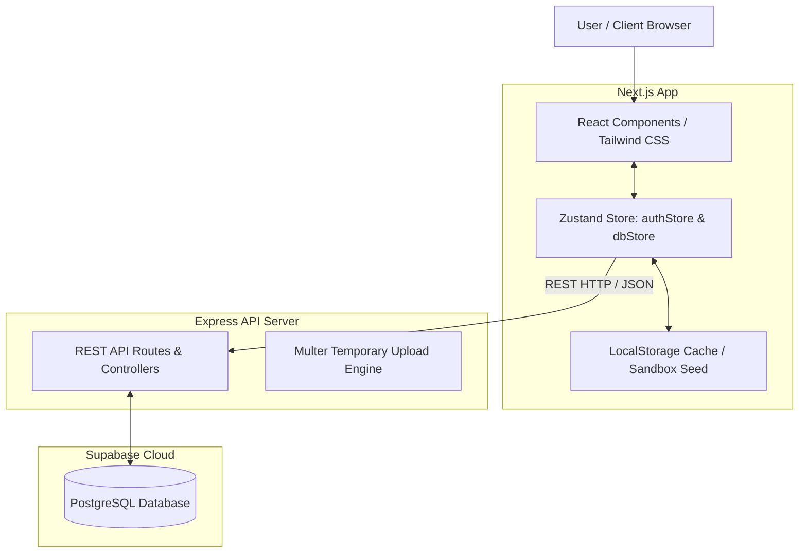

# Architectural SaaS ERP - System Guide

Welcome to the **Architectural SaaS ERP** platform—a real-time, high-fidelity collaboration workspace designed for modern architectural studios. The system streamlines the design lifecycle: mapping blueprints, managing structural review tasks, logging live drawing revisions, placing markup annotations, and tracking audit logs.

---

## 🛠️ Tech Stack & Architecture

The application is built on a modern, decoupled monorepo architecture consisting of a **Next.js Frontend**, a **Node.js/Express Backend**, and a **Supabase (PostgreSQL) Database**.

### 1. Frontend
* **Core Framework**: React 19 & Next.js 16.2 (utilizing Next.js App Router and Turbopack for optimized bundling).
* **Styling**: Tailwind CSS 4.0 for a high-fidelity, custom-designed dark-mode/slate design language, featuring grid-overlay blueprint panels and blueprint-paper backgrounds.
* **Icons & Motion**: `lucide-react` icons combined with `framer-motion` for micro-animations and smooth page transitions.
* **State Management**: **Zustand** stores (`useAuthStore` and `useDBStore`) configured with optimistic UI updates and real-time state synchronization.

### 2. Backend API
* **Runtime & Framework**: Node.js & Express.
* **File Uploads**: `multer` configured to utilize system-native temporary directories (`os.tmpdir()`) to prevent filesystem crashes on serverless architectures.
* **Routing**: Zero-config Vercel routing rules mapped to serverless functions for horizontal scaling.

### 3. Database & Storage
* **Engine**: PostgreSQL hosted on **Supabase**.
* **Integrations**: Custom database enums (`system_role`, `project_status`, `task_status`, `notification_type`) and schemas mapping projects, tasks, comments, drawing reviews, and audit logs.

---

## 🔄 The Dual-Mode Storage Engine

To support rapid local development, quick testing, and live cloud synchronization, the ERP platform is equipped with a **Dual-Mode Storage Engine**:

### 🌐 Live Cloud Database Mode
* **How it works**: Queries and mutation payloads are sent directly to the REST API / Express server which synchronizes to Supabase PostgreSQL in real-time.
* **Persistence**: Data is fully shared, persistent, and visible across all logged-in machines globally.

### 🧪 Virtual Sandbox Mode
* **How it works**: Accessible via a toggle on the login page. When turned **ON**, all REST API/Express backend connections are bypassed.
* **Seeding**: The store initializes immediately by generating mock database records matching the default `schema.sql` template.
* **Persistence**: Every project creation, member assignment, drawing revision upload, reviewer proposal, comment, and notification is serialized in real-time and saved in the browser's `localStorage` under `erp_db_state`. 
* **Benefits**: Perfect for offline testing, demos, or zero-config evaluation.

---

## 👥 System Roles & Permissions

Access control is strictly governed by user roles. Each role changes the sidebar layout, available tabs, and action capabilities:

| Role | Core Responsibilities | Key System Capabilities |
| :--- | :--- | :--- |
| **System Admin** | System maintenance & security audits | Access real-time audit logs, inspect activity trails, and dynamically modify user roles. |
| **Principal Architect** | Studio leadership & final sign-offs | Create projects, assign junior/senior teams, review drawings, and grant final drawing approvals. |
| **Senior Lead** | Task management & quality assurance | Supervise junior tasks, submit blueprint markup reviews, request revisions, and tag tasks. |
| **Junior Architect** | Design drafting & deliverable submissions | Upload new drawing versions, draft blueprints, update assigned tasks, and submit revision comments. |

---

## 🚀 Core Workflows: How to Use the System

Here is a step-by-step walkthrough of how studio teams collaborate on the platform:

### 1. Creating a Project & Roster Selection
* **Who**: **Principal Architect** (e.g. `sarah.jenkins@spatialdesign.com`)
* **How**: 
  1. Navigate to the **Projects** tab.
  2. Click **+ Create New Project**.
  3. Enter the project name, description, and status.
  4. Select a senior supervisor (Senior Lead) and junior draftsmen (Junior Architects) to form the project team.
  5. Submit. This creates the project and triggers notifications for the team.

### 2. Task Allocation & Egress Setup
* **Who**: **Principal** or **Senior Lead** (e.g. `david.miller@spatialdesign.com`)
* **How**:
  1. In the project dashboard, navigate to **Tasks**.
  2. Create a new task (e.g., *"Model parametric facade subdivisions"*), assign a **Junior Architect** as the assignee, and assign a **Senior Lead** as the supervisor.
  3. The junior architect receives an instant workspace notification alerting them of their assignment.

### 3. Drafting & Blueprint Uploads
* **Who**: **Junior Architect** (e.g. `alex.rivers@spatialdesign.com`)
* **How**:
  1. The junior opens the **Tasks** panel to view active assignments.
  2. Clicking **+ Upload Deliverable** redirects them to the project's **Drawing Vault**.
  3. Drag and drop the blueprint (or upload a `.dwg` / `.pdf` mock drawing).
  4. Fill out the **Changelog Comments** explaining the design layout, and click **Submit**.
  5. The blueprint status sets to `pending_review`, and the assigned Senior Lead receives a notification.

### 4. Interactive Marking & Revision Proposals
* **Who**: **Senior Lead**
* **How**:
  1. Open the notification or go to the **Drawing Vault** and select the pending drawing.
  2. Click on the drawing canvas to place **revision markers** (visual pins specifying coordinate-based changes).
  3. Provide markup notes for each pin.
  4. Click **Request Revisions**. The status changes to `changes_proposed` and notifies the Junior to submit a new version.

### 5. Final Approval & Automatic Task Promotion
* **Who**: **Principal Architect**
* **How**:
  1. Inspect the updated drawing and review pins/changelogs.
  2. Click **Approve Drawing**.
  3. In the approval modal, select the affected tasks to tag (e.g., the assigned facade task).
  4. Click **Confirm Approval**.
  5. The system automatically promotes all tagged tasks to `review` and alerts supervisors that they are ready for final sign-off, closing the loop.
